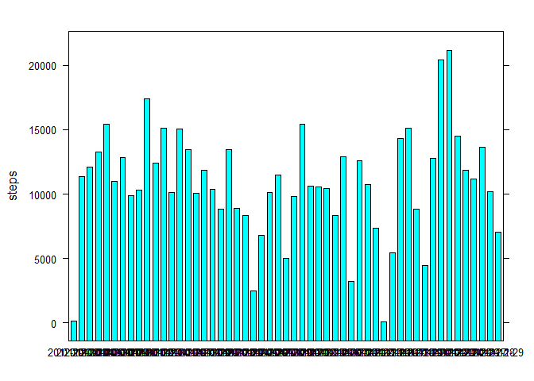

# Reproducible Research: Peer Assessment 1


## Loading and preprocessing the data


```r
activity <- read.csv(file = "activity.csv", header = TRUE)
head(activity)
```

```
##   steps       date interval
## 1    NA 2012-10-01        0
## 2    NA 2012-10-01        5
## 3    NA 2012-10-01       10
## 4    NA 2012-10-01       15
## 5    NA 2012-10-01       20
## 6    NA 2012-10-01       25
```

```r
str(activity)
```

```
## 'data.frame':	17568 obs. of  3 variables:
##  $ steps   : int  NA NA NA NA NA NA NA NA NA NA ...
##  $ date    : Factor w/ 61 levels "2012-10-01","2012-10-02",..: 1 1 1 1 1 1 1 1 1 1 ...
##  $ interval: int  0 5 10 15 20 25 30 35 40 45 ...
```

```r
summary(activity)
```

```
##      steps                date          interval     
##  Min.   :  0.00   2012-10-01:  288   Min.   :   0.0  
##  1st Qu.:  0.00   2012-10-02:  288   1st Qu.: 588.8  
##  Median :  0.00   2012-10-03:  288   Median :1177.5  
##  Mean   : 37.38   2012-10-04:  288   Mean   :1177.5  
##  3rd Qu.: 12.00   2012-10-05:  288   3rd Qu.:1766.2  
##  Max.   :806.00   2012-10-06:  288   Max.   :2355.0  
##  NA's   :2304     (Other)   :15840
```

## What is mean total number of steps taken per day?

### Histogram with the total number of steps taken per day


```r
tot <- aggregate(steps~date, activity, sum)

library(lattice)
barchart(steps~date, data = tot)
```

<!-- -->

### Table with the mean and median for the total number of steps taken per day


```r
ma <- aggregate(steps~date, activity, mean)
colnames(ma) <- c("date", "mean_steps")

me <- aggregate(steps~date, activity, median)
colnames(me) <- c("date", "median_steps")

merge(ma, me, by.x = "date", all.x = TRUE)
```

```
##          date mean_steps median_steps
## 1  2012-10-02  0.4375000            0
## 2  2012-10-03 39.4166667            0
## 3  2012-10-04 42.0694444            0
## 4  2012-10-05 46.1597222            0
## 5  2012-10-06 53.5416667            0
## 6  2012-10-07 38.2465278            0
## 7  2012-10-09 44.4826389            0
## 8  2012-10-10 34.3750000            0
## 9  2012-10-11 35.7777778            0
## 10 2012-10-12 60.3541667            0
## 11 2012-10-13 43.1458333            0
## 12 2012-10-14 52.4236111            0
## 13 2012-10-15 35.2048611            0
## 14 2012-10-16 52.3750000            0
## 15 2012-10-17 46.7083333            0
## 16 2012-10-18 34.9166667            0
## 17 2012-10-19 41.0729167            0
## 18 2012-10-20 36.0937500            0
## 19 2012-10-21 30.6284722            0
## 20 2012-10-22 46.7361111            0
## 21 2012-10-23 30.9652778            0
## 22 2012-10-24 29.0104167            0
## 23 2012-10-25  8.6527778            0
## 24 2012-10-26 23.5347222            0
## 25 2012-10-27 35.1354167            0
## 26 2012-10-28 39.7847222            0
## 27 2012-10-29 17.4236111            0
## 28 2012-10-30 34.0937500            0
## 29 2012-10-31 53.5208333            0
## 30 2012-11-02 36.8055556            0
## 31 2012-11-03 36.7048611            0
## 32 2012-11-05 36.2465278            0
## 33 2012-11-06 28.9375000            0
## 34 2012-11-07 44.7326389            0
## 35 2012-11-08 11.1770833            0
## 36 2012-11-11 43.7777778            0
## 37 2012-11-12 37.3784722            0
## 38 2012-11-13 25.4722222            0
## 39 2012-11-15  0.1423611            0
## 40 2012-11-16 18.8923611            0
## 41 2012-11-17 49.7881944            0
## 42 2012-11-18 52.4652778            0
## 43 2012-11-19 30.6979167            0
## 44 2012-11-20 15.5277778            0
## 45 2012-11-21 44.3993056            0
## 46 2012-11-22 70.9270833            0
## 47 2012-11-23 73.5902778            0
## 48 2012-11-24 50.2708333            0
## 49 2012-11-25 41.0902778            0
## 50 2012-11-26 38.7569444            0
## 51 2012-11-27 47.3819444            0
## 52 2012-11-28 35.3576389            0
## 53 2012-11-29 24.4687500            0
```

## What is the average daily activity pattern?

### Time series plot of the 5-minute interval and the average number of steps taken, averaged across all days


```r
ts <- aggregate(steps~interval, activity, mean)
with(ts, plot(interval, steps, type = "l"))
```

<!-- -->

### The 5-minute interval that contains the maximum number of steps is:


```r
maxx <- which(ts$steps == max(ts$steps))
ts[maxx,1]
```

```
## [1] 835
```

## Imputing missing values

### Total number of rows with missing values are:


```r
comp <- complete.cases(activity)
activity_complete <- activity[comp,]
nrow(activity) - nrow(activity_complete)
```

```
## [1] 2304
```

### Filling in the missing values with the mean of that specific date


```r
new_activity <- activity

for (i in 1:17568){
  
  if(is.na(new_activity[i,1])){
    new_activity[i,1] <- ma[new_activity[i,2],2]
  }
}
head(new_activity)
```

```
##    steps       date interval
## 1 0.4375 2012-10-01        0
## 2 0.4375 2012-10-01        5
## 3 0.4375 2012-10-01       10
## 4 0.4375 2012-10-01       15
## 5 0.4375 2012-10-01       20
## 6 0.4375 2012-10-01       25
```

### Now, with the new data set I will make a histogram of the total number of steps taken each day and calcula the mean and median to see what has changed


```r
tot_new <- aggregate(steps~date, new_activity, sum)

barchart(steps~date, data = tot_new)
```

<!-- -->

We can see that the histogram differ from the previous one, when we counted the missing values.


## Are there differences in activity patterns between weekdays and weekends?

### Create a factor variable indicating if a given date is a week day or weekend


```r
week_d <- c("segunda-feira", "terça-feira", "quarta-feira", "quinta-feira", "sexta-feira")

for (i in 1:17568){
  
  if (weekdays(as.Date(new_activity[i,2])) %in% week_d){
    new_activity[i,4] <- "weekday"
  }
  else{
    new_activity[i,4] <- "weekend"
  }
}
colnames(new_activity) <- c("steps", "date", "interval", "weekday_or_weekend")
new_activity$weekday_or_weekend <- as.factor(new_activity$weekday_or_weekend)
head(new_activity)
```

```
##    steps       date interval weekday_or_weekend
## 1 0.4375 2012-10-01        0            weekday
## 2 0.4375 2012-10-01        5            weekday
## 3 0.4375 2012-10-01       10            weekday
## 4 0.4375 2012-10-01       15            weekday
## 5 0.4375 2012-10-01       20            weekday
## 6 0.4375 2012-10-01       25            weekday
```

### Plot the 5-minute interval and the average number of steps taken, averaged across all week days and weekends


```r
spl <- split(new_activity, new_activity$weekday_or_weekend)
activity_week <- spl[[1]]
activity_weekend <- spl[[2]]
```

For the week days:


```r
averg_week <- aggregate(steps~interval, activity_week, mean)
with(averg_week, plot(interval, steps, type = "l"))
```

<!-- -->

For the weekends:


```r
averg_weekend <- aggregate(steps~interval, activity_weekend, mean)
with(averg_weekend, plot(interval, steps, type = "l"))
```

<!-- -->
